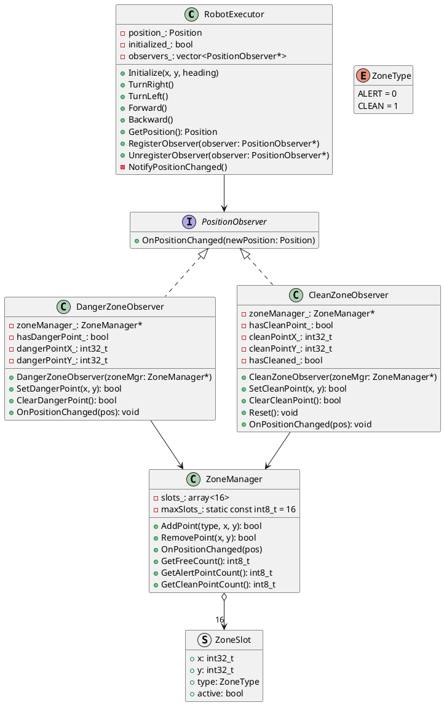

# RobotExecutor ZoneManager 设计方案

## 需求背景

### 新需求（需求5）

> Config组件可以反复调用接口配置/取消Executor组件告警坐标点和打扫坐标点，配置的告警坐标点和清扫坐标点不存在重复；
>
> 由于资源限制，Executor最多只能存在16个已配置的待告警或待清扫点（告警点和清扫点共享）；Config组件通过配置取消告警或者清扫坐标点后，Executor则回收对应的配置资源；
>
> 当Executor组件触发清扫接口后，可以自动回收一个坐标点的配置资源，用于Config组件继续配置新的告警坐标或者清扫坐标；

### 当前问题

1. **资源无法共享** - DangerZoneObserver和CleanZoneObserver各维护一个点，无法共享16个槽位
2. **无法配置/取消** - 没有提供取消已配置坐标点的接口
3. **无法自动回收** - 清扫后没有自动回收机制
4. **扩展性差** - 每个Observer只能存一个点

---

## 设计目标

1. **保留现有Observer接口** - 旧代码无需修改
2. **统一16个资源槽位** - 告警点和清扫点共享
3. **支持配置/取消** - Config可添加和移除坐标点
4. **自动回收** - 清扫后自动释放槽位

---

## 架构设计

### PlantUML类图



---

## 核心类详细设计

### 1. ZoneManager

```cpp
#ifndef ZONE_MANAGER_H
#define ZONE_MANAGER_H

#include "mcl/stdc.h"
#include <cstdint>
#include <array>
#include "robot_common_type.h"

MCL_STDC_BEGIN

enum class ZoneType : int8_t {
    Alert = 0,
    Clean = 1
};

struct ZoneSlot {
    int32_t x {0};
    int32_t y {0};
    ZoneType type {ZoneType::Alert};
    bool active {false};
};

class ZoneManager {
public:
    static constexpr int8_t kMaxSlots = 16;

    ZoneManager();

    bool AddPoint(ZoneType type, int32_t x, int32_t y);
    bool RemovePoint(int32_t x, int32_t y);
    void OnPositionChanged(const Position& newPosition);

    int8_t GetFreeCount() const;
    int8_t GetAlertPointCount() const;
    int8_t GetCleanPointCount() const;

private:
    int8_t FindSlot(int32_t x, int32_t y) const;
    int8_t FindFreeSlot() const;
    void ActivateSlot(int8_t index, ZoneType type, int32_t x, int32_t y);
    void DeactivateSlot(int8_t index);

    std::array<ZoneSlot, kMaxSlots> slots_{};
    int8_t alertCount_;
    int8_t cleanCount_;
};

MCL_STDC_END

#endif
```

### 2. ZoneManager实现要点

```cpp
#include "executor/zone_manager.h"
#include "alert/alert.h"
#include "clean/clean.h"

ZoneManager::ZoneManager()
    : alertCount_(0), cleanCount_(0)
{
}

bool ZoneManager::AddPoint(ZoneType type, int32_t x, int32_t y)
{
    // 1. 检查是否已存在相同坐标点
    int8_t existing = FindSlot(x, y);
    if (existing >= 0) {
        return false; // 已存在
    }

    // 2. 检查是否有空闲槽位
    int8_t freeSlot = FindFreeSlot();
    if (freeSlot < 0) {
        return false; // 槽位已满
    }

    // 3. 添加点到槽位
    ActivateSlot(freeSlot, type, x, y);
    return true;
}

bool ZoneManager::RemovePoint(int32_t x, int32_t y)
{
    int8_t index = FindSlot(x, y);
    if (index < 0) {
        return false; // 点不存在
    }
    DeactivateSlot(index);
    return true;
}

void ZoneManager::OnPositionChanged(const Position& newPosition)
{
    for (int8_t i = 0; i < kMaxSlots; ++i) {
        if (!slots_[i].active) {
            continue;
        }
        if (slots_[i].x == newPosition.x && slots_[i].y == newPosition.y) {
            if (slots_[i].type == ZoneType::Alert) {
                alert(IN_DANGEROUS, newPosition.x, newPosition.y);
            } else if (slots_[i].type == ZoneType::Clean) {
                // 触发clean后自动回收槽位
                clean(newPosition.x, newPosition.y);
                DeactivateSlot(i);
            }
        }
    }
}

int8_t ZoneManager::GetFreeCount() const
{
    return kMaxSlots - alertCount_ - cleanCount_;
}
```

### 3. 通用类型定义

```cpp
#ifndef ROBOT_COMMON_TYPE_H
#define ROBOT_COMMON_TYPE_H

#include <cstdint>

enum class Heading : int32_t {
    North = 0,
    East = 1,
    South = 2,
    West = 3
};

struct Position {
    int32_t x {0};
    int32_t y {0};
    Heading heading {Heading::North};
};

#endif
```

### 4. DangerZoneObserver实现

```cpp
class DangerZoneObserver final : public PositionObserver {
public:
    explicit DangerZoneObserver(ZoneManager* zoneManager = nullptr);

    bool SetDangerPoint(int32_t x, int32_t y);
    bool ClearDangerPoint();

    void OnPositionChanged(const Position& newPosition) override;

private:
    ZoneManager* zoneManager_;
    bool hasDangerPoint_;
    int32_t dangerPointX_;
    int32_t dangerPointY_;
};

bool DangerZoneObserver::SetDangerPoint(int32_t x, int32_t y)
{
    // 不能重复设置
    if (hasDangerPoint_) {
        return false;
    }

    if (zoneManager_) {
        if (zoneManager_->AddPoint(ZoneType::Alert, x, y)) {
            hasDangerPoint_ = true;
            return true;
        } else {
            return false;
        }
    }
    // 兼容未设置区域管理类（ZoneManager）的使用方式
    dangerPointX_ = x;
    dangerPointY_ = y;
    hasDangerPoint_ = true;
    return true;
}

bool DangerZoneObserver::ClearDangerPoint()
{
    if (!hasDangerPoint_) {
        return true;
    }

    if (zoneManager_) {
        if (zoneManager_->RemovePoint(dangerPointX_, dangerPointY_)) {
            hasDangerPoint_ = false;
            return true;
        } else {
            return false;
        }
    }
    // 兼容未设置区域管理类（ZoneManager）的使用方式
    hasDangerPoint_ = false;
    return true;
}

void DangerZoneObserver::OnPositionChanged(const Position& newPosition)
{
    if (!hasDangerPoint_) {
        return;
    }

    if (zoneManager_) {
        zoneManager_->OnPositionChanged(newPosition);
        return;
    }

    // 兼容未设置区域管理类（ZoneManager）的使用方式
    if (dangerPointX_ == newPosition.x && 
        dangerPointY_ == newPosition.y) {
        alert(IN_DANGEROUS, newPosition.x, newPosition.y);
    }
}
```

### 5. CleanZoneObserver实现

```cpp
class CleanZoneObserver final : public PositionObserver {
public:
    explicit CleanZoneObserver(ZoneManager* zoneManager = nullptr);

    bool SetCleanPoint(int32_t x, int32_t y);
    bool ClearCleanPoint();
    void Reset();

    void OnPositionChanged(const Position& newPosition) override;

private:
    ZoneManager* zoneManager_;
    bool hasCleanPoint_;
    int32_t cleanPointX_;
    int32_t cleanPointY_;
    bool hasCleaned_;
};

bool CleanZoneObserver::SetCleanPoint(int32_t x, int32_t y)
{
    // 不能重复设置
    if (hasCleanPoint_) {
        return false;
    }

    if (zoneManager_) {
        if (zoneManager_->AddPoint(ZoneType::Clean, x, y)) {
            hasCleanPoint_ = true;
            return true;
        } else {
            return false;
        }
    }

    // 兼容未设置区域管理类（ZoneManager）的使用方式
    cleanPointX_ = x;
    cleanPointY_ = y;
    hasCleanPoint_ = true;
    return true;
}

bool CleanZoneObserver::ClearCleanPoint()
{
    if (!hasCleanPoint_) {
        return true;
    }

    if (zoneManager_) {
        if (zoneManager_->RemovePoint(cleanPointX_, cleanPointY_)) {
            hasCleanPoint_ = false;
            return true;
        } else {
            return false;
        }
    }
    // 兼容未设置区域管理类（ZoneManager）的使用方式
    hasCleanPoint_ = false;
    return true;
}

void CleanZoneObserver::Reset()
{
    hasCleaned_ = false;
}

void CleanZoneObserver::OnPositionChanged(const Position& newPosition)
{
    if (!hasCleanPoint_ || hasCleaned_) {
        return;
    }

    if (zoneManager_) {
        zoneManager_->OnPositionChanged(newPosition);
        hasCleaned_ = true;
        return;
    }
    // 兼容未设置区域管理类（ZoneManager）的使用方式
    if (cleanPointX_ == newPosition.x && 
        cleanPointY_ == newPosition.y) {
        clean(newPosition.x, newPosition.y);
        hasCleaned_ = true;
    }
}
```

---

## 使用方式

### 方式1：直接使用ZoneManager（推荐）

```cpp
// Config组件使用
ZoneManager zoneMgr;

// 添加告警点
zoneMgr.AddPoint(ZoneType::Alert, 5, 3);
zoneMgr.AddPoint(ZoneType::Alert, 10, 20);

// 添加清扫点
zoneMgr.AddPoint(ZoneType::Clean, 2, 1);
zoneMgr.AddPoint(ZoneType::Clean, 7, 8);

// 移除告警点
zoneMgr.RemovePoint(5, 3);

// 查询状态
int8_t freeSlots = zoneMgr.GetFreeCount(); // 14

// 机器人移动时自动触发
RobotExecutor executor;
DangerZoneObserver danger(&zoneMgr);
CleanZoneObserver clean(&zoneMgr);
executor.RegisterObserver(&danger);
executor.RegisterObserver(&clean);

executor.Initialize(0, 0, Heading::North);
executor.Forward(); // 到达(0,1)，触发clean
// clean触发后槽位自动回收，freeSlots变为15
```

### 方式2：保留旧的Observer接口（无需ZoneManager）

```cpp
// 旧代码兼容，无需ZoneManager
RobotExecutor executor;
DangerZoneObserver danger;  // 无参构造
CleanZoneObserver clean;    // 无参构造

executor.RegisterObserver(&danger);
executor.RegisterObserver(&clean);

danger.SetDangerPoint(5, 3);
clean.SetCleanPoint(2, 1);

// 正常使用，功能不变
```

---

## 对比总结

| 方面 | 旧架构 | 新架构 |
|------|-------|--------|
| 资源管理 | 各Observer独立 | 统一ZoneManager |
| 槽位数量 | 无限制（每个Observer一个点） | 共享16个槽位 |
| 配置/取消 | 不支持 | 支持AddPoint/RemovePoint |
| 自动回收 | 不支持 | 支持（clean后自动回收） |
| 旧代码兼容 | - | 完全兼容（无ZoneManager时保持原功能） |

---

## 实现计划

1. 创建 `robot_common_type.h` - 定义通用类型 Position 和 Heading
2. 创建 `zone_manager.h` 和 `zone_manager.cpp` - ZoneManager 实现
3. 修改 `danger_zone_observer.h/.cpp` - 支持委托模式
4. 修改 `clean_zone_observer.h/.cpp` - 支持委托模式
5. 添加单元测试