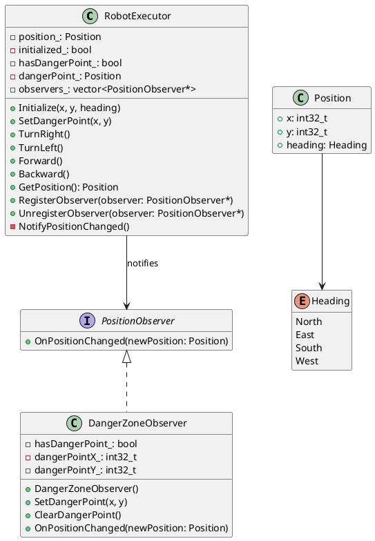

## Context

RobotExecutor组件已实现移动功能，需要增加危险坐标点告警功能。当Config组件设置危险坐标点后，机器人在移动到该点时应触发Alert组件的告警。

Alert组件接口已存在于deps/alert-intf：
- alert(AlertType type, int x, int y)
- type = IN_DANGEROUS (3) 表示"经过危险坐标告警"

## Goals / Non-Goals

**Goals:**
- 实现SetDangerPoint方法，设置危险坐标点
- 在每次移动后检测是否到达危险坐标点
- 到达危险坐标时调用alert(IN_DANGEROUS, x, y)触发告警
- 支持重复触发告警（同一点多次经过）
- 使用观察者模式解耦检测逻辑

**Non-Goals:**
- 多个危险坐标点管理（仅支持单一危险点）
- 危险坐标点与初始化位置冲突检测（由Config保证）
- 告警后的自动规避行为

## Design - Observer Pattern

### Architecture (PlantUML Class Diagram)



### Class Design

**PositionObserver (Interface)**
```cpp
class PositionObserver {
public:
    virtual ~PositionObserver() = default;
    virtual void OnPositionChanged(const Position& newPosition) = 0;
};
```

**DangerZoneObserver (Implementation)**
```cpp
class DangerZoneObserver final : public PositionObserver {
public:
    explicit DangerZoneObserver();
    void SetDangerPoint(int32_t x, int32_t y);
    void OnPositionChanged(const Position& newPosition) override;
    
private:
    bool hasDangerPoint_;
    int32_t dangerPointX_;
    int32_t dangerPointY_;
};
```

**RobotExecutor Changes**
```cpp
class RobotExecutor {
public:
    void RegisterObserver(PositionObserver* observer);
    void UnregisterObserver(PositionObserver* observer);
    
private:
    void NotifyPositionChanged();
    std::vector<PositionObserver*> observers_;
};
```

### Benefits

1. **消除重复代码**: 将危险点检测逻辑集中到DangerZoneObserver中，TurnRight/TurnLeft/Forward/Backward不再需要各自包含检测逻辑
2. **单一职责**: RobotExecutor负责移动，危险检测由专门的观察者负责
3. **可扩展性**: 可轻松添加多个观察者（如清洁区域、路径记录等）
4. **可测试性**: DangerZoneObserver可独立单元测试

## Decisions

### 危险点检测时机
选择在移动**后**检测危险坐标，而非移动**前**。这样可以确保告警触发时机器人确实到达了该位置。

### 告警触发策略
- 每次移动到危险坐标时都触发告警（重复触发）
- 在危险坐标点转向也要触发告警
- 使用alert接口，传入当前危险坐标的x, y值

### 数据结构
使用bool + separate coordinates表示可选的危险坐标点：
- 未设置时hasDangerPoint_为false
- 设置后存储危险点坐标

## Implementation

1. 创建PositionObserver接口 (position_observer.h)
2. 创建DangerZoneObserver实现 (danger_zone_observer.h + .cpp)
3. 修改RobotExecutor添加观察者注册机制
4. RobotExecutor在每次位置变化后调用NotifyPositionChanged()

## Risks / Trade-offs

**风险**: 危险坐标未设置时调用告警
- Mitigation: 仅在已设置危险坐标且移动到达该坐标时才触发告警

**风险**: 初始化位置就是危险点（需求说Config保证不会）
- Mitigation: 不在此组件中检测，由Config组件保证